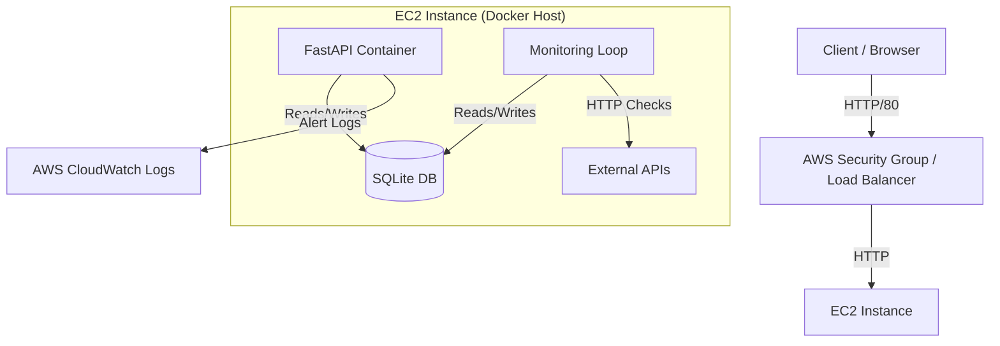

# API Health Monitoring System - Design Document

## 1. High-Level System Architecture

The system follows a lightweight, self-contained architecture designed for ease of deployment while maintaining scalability principles.

### Architecture Diagram

## 2. Component Interactions & Data Flow

1.  **Configuration**: User executes `POST /targets` to add an API endpoint. This is saved to the Database (`MonitorTarget` table).
2.  **Monitoring Loop**:
    *   A background `asyncio` task runs every 60 seconds (configurable).
    *   It queries active targets from the Database.
    *   It spawns concurrent `httpx` requests to check each target.
    *   Results (Status Code, Latency) are written to the `HealthCheckResult` table.
3.  **Alerting**:
    *   After each check, the system evaluates if `is_healthy` is False.
    *   If unhealthy, it logs an error (which in production would trigger a CloudWatch Alarm or SNS topic).
4.  **In-Memory Optimization**: The system uses `asyncio` for non-blocking I/O, allowing a single thread to monitor hundreds of endpoints efficiently.

## 3. Design Decisions & Trade-offs

### Backend: FastAPI vs Flask/Django
*   **Decision**: Chosen **FastAPI**.
*   **Justification**: Native `async` support is critical for high-concurrency network I/O (checking many APIs simultaneously). Flask would require threading, which is heavier.
*   **Trade-off**: Slightly higher learning curve than Flask, but better performance.

### Database: SQLite vs RDS (Postgres)
*   **Decision**: Selected **SQLite** (embedded) for portability, utilizing **SQLModel** to abstract database specifics.
*   **Justification**: Reduces infrastructure complexity for independent deployments and local development.
*   **Scalability Path**: By changing the `DATABASE_URL` env var, the application can instantly connect to an AWS RDS PostgreSQL instance, satisfying the production scalability requirement.

### Infrastructure: EC2 vs ECS/Lambda
*   **Decision**: **EC2 (Docker)**.
*   **Justification**: Provides direct control over the execution environment and networking configurations.
*   **Trade-off**: Requires patching/maintenance (User Data script handles initial setup).

## 4. Scalability Strategy (Production)

To scale this system for thousands of endpoints:
1.  **Database**: Migrate to **AWS RDS Aurora** (Reader/Writer split).
2.  **Compute**: Deploy the Container to **ECS Fargate**.
3.  **Concurrency**: The background loop acts as a "Worker". We can run multiple Worker containers, sharding targets by ID (e.g., Worker A checks IDs 1-1000, Worker B checks 1001-2000).
